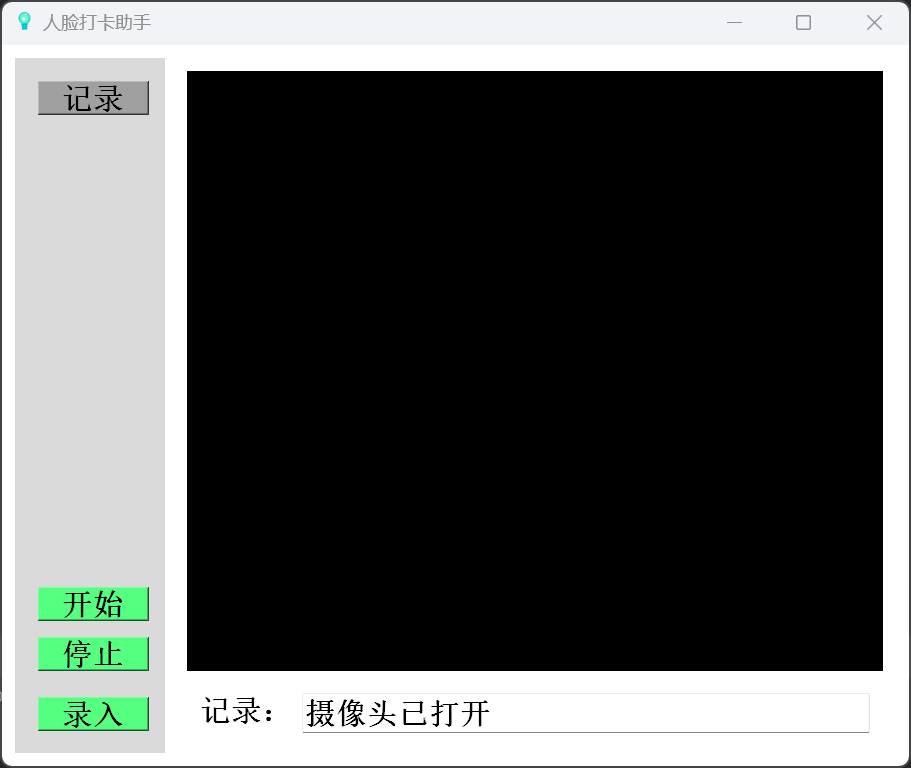
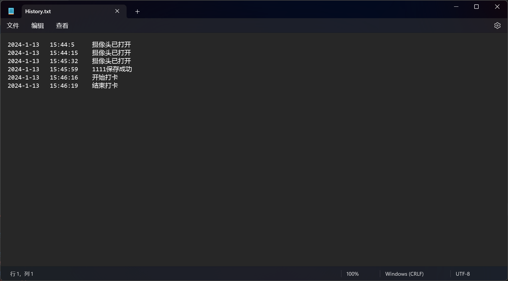

# 智慧打卡

## 1. 基本信息

- 作者: GMCY
- 系列: 未分类
- 仓库: [GitHub](https://github.com/GMCY2020/Clever-Sign) | [Gitee](https://gitee.com/GMCY2020/Clever-Sign)
- 话题(GitHub): [python](https://github.com/topics/python) \ [pyqt5](https://github.com/topics/pyqt5) \ [cv](https://github.com/topics/cv)
- 创建时间: 2021/3/13

## 2. 介绍

- 用 `Python` 写的一个人脸打卡程序
- (高一老师叫我试写一下，就写了一下\\(￣︶￣)/)
- 个人学习自用
- 应该有亿点点bug

- 功能：
  - 人脸识别
  - 打卡记录

## 3. 环境

编辑器

- `PyCharm`

语言

- `Python 3.7.9`

库

- `face_recognition`
- `numpy`
- `opencv_contrib_python`
- `PyQt5`
- `PyQt5_sip`
- `等`

## 4. 使用

- 安装依赖 `requirements.txt`
- `dlib` 安装不了 使用 `pip` 安装 `docs/dlib~.whl`
- 运行 `Clever_Sign.py`
- 不用可能大概率，就是有 bug \(￣︶￣*\))

## 5. 效果图

主界面

录入人像

查看记录
